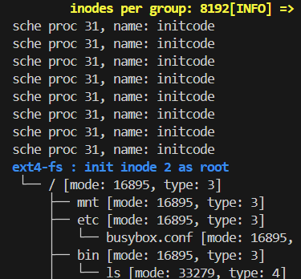

# 程序段加载(该思想已废弃)
```cpp
		program_section_desc _prog_sections[max_program_section_num];
		int					 _prog_section_cnt = 0;
```
需要修改的函数
- user_init
- fork
- execve
- free_proc
# 对于sched函数多次调用的解释

在第一次进入fork_ret时, 会设置磁盘, 因此会发生多次中断, 每次中断都会重新进入sched调度器进行调度
# sys_execve(TODO)
- 没有写学长队的第四步, 可能用于glibc, 后面跑不起来再补
- 文件系统没加锁, 可能会有问题(还没验证)
- 用户栈设置时没有完全按照学长代码跑
- 错误处理代码冗余太多了(每一个错误都写了一遍错误处理)
- 为什么我感觉在压入envp和argv的时候, 压反了
- 写了设置随机数(应该不会出错吧)
- 没写辅助向量(auxv)

# schedular函数可能有问题